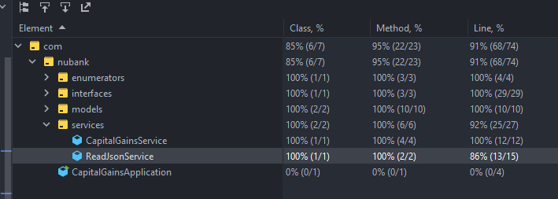

# Nubank - Ganho de Capital

<a href="https://spring.io/" target="_blank"></a>
<a href="https://www.oracle.com/java/technologies/downloads" target="_blank"></a>
<a href="https://github.com/docker" target="_blank"></a>
<a href="https://maven.apache.org/" target="_blank"></a>

# Execução local
### Você precisará de:

* [Docker](https://github.com/docker)
* [docker-compose](https://github.com/docker/compose)

### Empacotando e iniciando a aplicação:
Faça extração dos arquivos e navegue até a pasta do projeto. 
Em seguida, execute os comandos abaixo para iniciar a aplicação:

```sh
# Executa, via container, passando o "caseOne.json" para o STDIN da aplicação
docker-compose run -T capital-gains < json/caseOne.txt
```
Pode levar algum tempo para baixar e compilar no container, como estamos usando [_multi stage builds_](https://docs.docker.com/develop/develop-images/multistage-build/) com cache local, apenas na primeira vez.

O resultado esperado é um JSON, via saída padrão, com as taxas calculadas com base nas operações de entrada:

```json
[{"tax":0.00},{"tax":0.00},{"tax":0.00}]
```

Ou, caso deseje informar manualmente cada entrada:
```sh
docker-compose run capital-gains
```

### Testes
Os casos base apresentados na especificação do desafio estão dentro da pasta ```json``` na raiz do projeto e são usados nos testes unitários da aplicação.
Para facilitar manutenção e extensão dos testes, criei um teste parâmetrizado para todos os casos base.
Além dos casos base, adicionei o arquivo ```allCasesAtOnce.txt``` que simula todos os casos sendo inseridos de uma única vez na aplicação, assim foi possível atingir 100% de cobertura real do código.
No momento, não pude identificar outros cenários extremos ou casos de borda que pudessem ser adicionados aos testes. 

### Cobertura de Código

### Decisões de Projeto
Os requisitos de negócio indicam uma estrutura simples e direta, portanto, não tive grandes decisões à nível de arquitetura.
Para essa aplicação foram usados:
* [SpringBoot](https://spring.io/projects/spring-boot) pensando em futuras extensões e facilidade de integração com outros pacotes.
* [Junit5](https://junit.org/junit5/) para criar e executar testes automatizados da aplicação. É uma biblioteca que uso há bastante tempo e tem ótima integração com o ecossistema Spring.
* [Jackson](https://github.com/FasterXML/jackson) para serialização e desserialização de objetos em JSON na aplicação. Também é uma aplicação que tem muita sinergia com o ecossistema Spring.
* [Lombok](https://projectlombok.org/) para uso de anotações visando reduzir código _boilerplate_ (principalmente construtores e métodos acessores).
* [Maven](https://maven.apache.org/) gerenciando as dependências e construção da aplicação.

### Estrutura do Projeto
Os arquivos estão sendo organizados por artefatos (interfaces, entidades, serviços e etc.)
Seguindo os príncipios [DRY](https://en.wikipedia.org/wiki/Don%27t_repeat_yourself), [SOLID](https://en.wikipedia.org/wiki/SOLID) e [KISS](https://en.wikipedia.org/wiki/KISS_principle) essa foi a estrutura mais simples, expansível e que cumpre os requisitos de negócio que pensei.
Assim temos o caso de uso implementado no ```CapitalGainsService.java```, que é o componente responsável por chamar componentes internos (componente de leitura da entrada e cálculo do imposto) da aplicação pra atendender ao caso de uso

Além disso, a parte de cálculo, que considero o _core_ do desafio, foi desenvolvida com foco em possíveis extensões (por exemplo, aplicar faixas de imposto, diferentes percentuais e etc.)